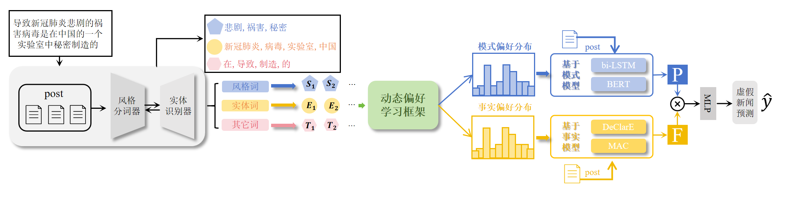
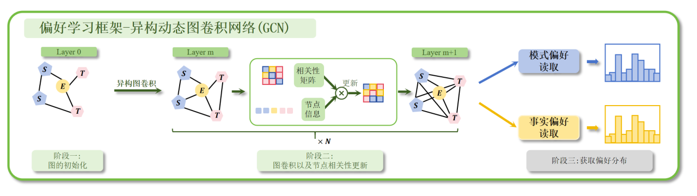
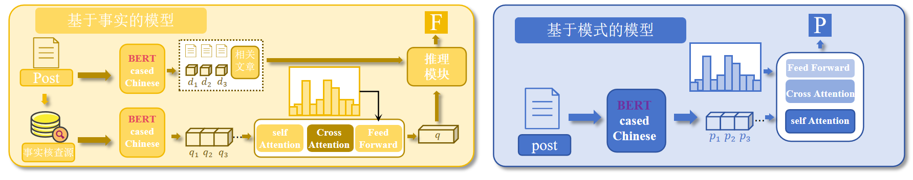

# Pref-FEND 论文复现

> **Integrating Pattern- and Fact-based Fake News Detection via Model Preference Learning**  
> Qiang Sheng\*, Xueyao Zhang\*, Juan Cao, and Lei Zhong  
> *Proceedings of the 30th ACM International Conference on Information and Knowledge Management (CIKM 2021)*  
>
> 📄 [PDF](https://dl.acm.org/doi/10.1145/3459637.3482440) / 🎞️ [Poster](https://www.zhangxueyao.com/data/cikm2021-PrefFEND-poster.pdf) / 💻 [Code](https://github.com/ICTMCG/Pref-FEND)

---

## 📂 数据集说明

原始论文实验所用数据集包含：

- [Weibo Dataset](https://github.com/ICTMCG/Pref-FEND/tree/main/dataset/Weibo)
- [Twitter Dataset](https://github.com/ICTMCG/Pref-FEND/tree/main/dataset/Twitter)

> ⚠️ 注意：需提交 [数据使用申请](https://forms.office.com/r/HF00qdb3Zk) 才可下载。

除此之外，还使用了其它公开数据集：

- [CHEF](https://github.com/THU-BPM/CHEF)（强烈推荐 🤓）
- GossipCop  
（由于文件较大，未上传至 GitHub，需请邮件联系：**loyiv5477@gmail.com**）

---

## 📦 安装依赖环境

请确保你已安装 Python 和 pip，然后运行以下命令安装依赖：

```bash
pip install -r requirements.txt
```

---

## ⚙️ 预处理流程

### 步骤 1：词项识别（风格词/实体词）

```bash
python process.py
```

该步骤将输出 JSON 格式的风格词/实体词数据，保存在 `raw/` 目录。

---

### 步骤 2：Tokenize 数据

```bash
cd preprocess/tokenize
python get_post_tokens.py --dataset [dataset] --pretrained_model [bert_pretrained_model]
```

> 中文数据请使用 `bert-base-chinese`，英文请使用 `bert-base-cased`。  
> 模型下载地址：[bert-base-cased](https://github.com/rohithjoginapally/bert-base-cased)

---

### 步骤 3：构建异构图结构（Graph Initialization）

```bash
cd ../graph_init
python init_graph.py --dataset [dataset] --max_nodes [max_tokens_num]
```

---


### 步骤 4：事实模型准备（可选）

#### 4.1 Tokenize 文章内容

```bash
cd ../tokenize
python get_articles_tokens.py --dataset [dataset] --pretrained_model [bert_pretrained_model]
```

#### 4.2 使用 BM25 检索证据

```bash
cd ../bm25
python retrieve.py --dataset [dataset]
```

---

### 步骤 5：特定模型组件预处理（可选）



#### 5.1 EANN-Text 模型

```bash
cd ../EANN_Text
python events_clustering.py --dataset [dataset] --events_num [clusters_num]
```

#### 5.2 BERT-Emo 模型

```bash
cd ../BERT_Emo/code/preprocess
python input_of_emotions.py --dataset [dataset]
```

---

## 🚀 模型训练与推理

```bash
cd model
mkdir ckpts
```

以Weibo数据集为例，运行：

```bash
# BiLSTM + DeClarE (Pref-FEND)
CUDA_VISIBLE_DEVICES=0 python main.py --dataset 'weibo' \
--use_preference_map True --use_pattern_based_model True --use_fact_based_model True \
--pattern_based_model 'BiLSTM' --fact_based_model 'DeClarE' \
--lr 1e-4 --batch_size 4 --epochs 20 \
--save 'ckpts/BiLSTM+DeClarE_with_Pref-FEND'
```

这采用的基础模型分别为BiLSTM和DeClarE。结果将保存在 `model/ckpts/BiLSTM+DeClarE_with_Pref-FEND`，是一个.pt文件。

---

## 📊 实验结果

所有实验模型的中间结果与 checkpoint 保存在：

```bash
model/ckpts/
```


---

## 📚 引用

```bibtex
@inproceedings{Pref-FEND,
  author    = {Qiang Sheng and
               Xueyao Zhang and
               Juan Cao and
               Lei Zhong},
  title     = {Integrating Pattern- and Fact-based Fake News Detection via Model
               Preference Learning},
  booktitle = {{CIKM} '21: The 30th {ACM} International Conference on Information
               and Knowledge Management, Virtual Event, Queensland, Australia, November
               1 - 5, 2021},
  pages     = {1640--1650},
  year      = {2021},
  url       = {https://doi.org/10.1145/3459637.3482440},
  doi       = {10.1145/3459637.3482440}
}
```
